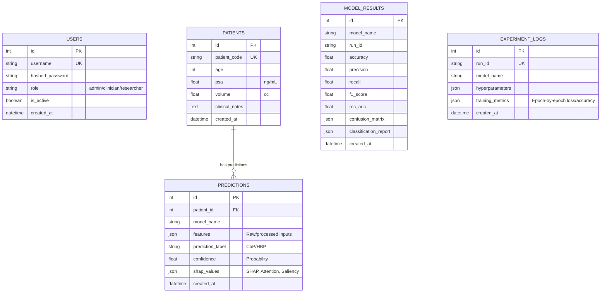

# Project Architecture & System Explanation
## E-Nose Prostate Cancer Detection using Explainable Hybrid CNN-GRU-Attention Deep Learning

This document provides a comprehensive technical overview and explanation of the AI-based clinical decision support system for non-invasive prostate cancer screening. It is designed to assist developers, researchers, and academic reviewers in understanding the system architecture, machine learning models, database schema, explainability methods (XAI), and clinical workflows.

---

## 1. Project Overview

### What the Project Does
This project is a clinical decision support system that detects **Prostate Cancer (CaP)** and differentiates it from **Benign Prostatic Hyperplasia (HBP)** using non-invasive urinalysis. Rather than relying on traditional blood tests or invasive biopsies, it analyzes the urine headspace gas profile using a 32-sensor electronic nose (E-Nose). 

The system consists of:
*   **A Full-Stack Dashboard (Next.js + TypeScript)**: Enabling clinicians to manage patient profiles, trigger diagnoses, run benchmark evaluations, and review explainability visualizations.
*   **An API Gateway Backend (FastAPI + Python)**: Handling authentication, patient record CRUD operations, model retraining, and real-time inference routing.
*   **A Machine Learning Core (TensorFlow/Keras + Scikit-Learn + XGBoost)**: Containing pre-trained baseline models (Random Forest, XGBoost, Dense Neural Network) and the proposed sequence-based **Hybrid CNN-GRU-Attention Deep Learning Model**.
*   **Explainable AI Engine (SHAP + Saliency Gradients + Attention Maps)**: Providing double-paradigm explainability by detailing which specific sensors and volatile organic compounds (VOCs) drove the diagnostic output.

### Research Objective
The core scientific objective is to develop a deep sequence model that treats E-Nose sensor response records as spatial-temporal grids rather than flat tables. By modeling the 32 sensors sequentially, the system extracts channel interactions, temporal transients, and baseline drifts, achieving robust and interpretable classification under heavily class-weighted clinical requirements (penalizing false negatives to protect patient safety).

### Why E-Nose (Electronic Nose) is Used
An E-Nose mimics the biological olfactory system. It uses an array of chemical sensors (specifically **Metal Oxide Semiconductor (MOS)** gas sensors, such as the **MOOSY-32** array) that change electrical resistance when they interact with volatile compounds. When urine headspace gas is pumped over the array, each sensor exhibits a unique voltage change curve based on the composition of Volatile Organic Compounds (VOCs) present. 

Traditional gas chromatography-mass spectrometry (GC-MS) is highly accurate but expensive, slow, and requires specialized lab technicians. The E-Nose offers a cost-effective, rapid, and point-of-care alternative.

### Why Prostate Cancer Detection Matters
Prostate Cancer is one of the leading causes of cancer-related deaths in men. Current standard screening relies on:
1.  **PSA Test (Serum Prostate-Specific Antigen)**: Highly sensitive but has a very low specificity (20–30% Positive Predictive Value). High PSA can be caused by benign conditions like Prostatic Hyperplasia (HBP) or prostatitis, leading to massive rates of false positives.
2.  **Invasive Biopsy**: Follows a positive PSA test. Biopsies carry risks of pain, bleeding, infection, and clinical over-treatment of slow-growing, non-lethal tumors.

Providing a non-invasive E-Nose screening tool with high specificity acts as a gatekeeper, filtering out benign cases (HBP) and preventing unnecessary biopsies while ensuring patients with aggressive cancer (CaP) are directed to confirmatory imaging (MRI) and targeted biopsy.

---

## 2. Research Contribution & Novelty

### Spatial-Temporal Representation (Sensor-Sequence Mapping)
Most E-Nose papers flatten the multi-sensor readings into a single tabular row (e.g., $32 \text{ sensors} \times 31 \text{ features} = 992 \text{ features}$). This flat approach loses the spatial correlation of the physical sensor layout and the sequential relationship of sensor arrays. 

This project contributes a sequence-based modeling paradigm:
*   An E-Nose acquisition session is structured as a sequence of shape $(32, 31)$, where each of the $32$ sequence steps represents one physical sensor ($S_1, S_2, \dots, S_{32}$), and each step contains $31$ temporal, differential, statistical, and concentration features.
*   This structure allows sequence models (like CNNs and GRUs) to learn local sensor-to-sensor correlations and cumulative signal transients across the entire array.

### Proposed Hybrid CNN-GRU-Attention Architecture
The core contribution is a hybrid architecture designed to exploit this spatial-sequential grid:
1.  **1D CNN Block**: Extracts local spatial features and channel relationships between adjacent sensors using local sliding kernels.
2.  **Gated Recurrent Unit (GRU) Block**: Processes the sequence of spatial feature maps to capture the dynamic, sequential flow of transient responses across the sensor array.
3.  **Temporal Attention Mechanism**: Learns context weights across the 32 sensor steps, highlighting which sensors are most diagnostic for the specific patient.

### Double-Paradigm Explainability (XAI)
To gain clinical trust, the system implements two explainability paths:
1.  **Tabular XAI**: TreeSHAP and KernelSHAP are applied to the tabular baselines (Random Forest, XGBoost, DNN) to show the mathematical contribution of individual features.
2.  **Proposed Sequence XAI**: Combines physical **Attention Weights** (indicating which physical sensor channel $S_1 \dots S_{32}$ dominated the classification) with **Backpropagated Saliency Gradients** (measuring the gradient of the cancer probability output with respect to each input feature to isolate specific VOC markers).

### Benchmarking and Ablation Audits
The project implements a full benchmarking and ablation engine. It compares the proposed model against Random Forest, XGBoost, and the reference paper's baseline Dense Neural Network (DNN). The ablation study systematically removes the Attention layer, the GRU block, and the CNN block to isolate their respective performance gains.

---

## 3. Frontend Explanation (Next.js Dashboard)

The frontend is a modern Next.js 14 application built with TypeScript and TailwindCSS, structured under the App Router model.

```
frontend/src/app/
├── page.tsx                    # Landing Page & Clinician Login
├── globals.css                 # Custom Styling and Tailwind directives
├── config.ts                   # API URL config mapping local/prod gateways
└── dashboard/                  # Nested Main Dashboard Layout
    ├── layout.tsx              # Sidebar navigation, User profile header
    ├── page.tsx                # Dashboard landing (System stats, histories)
    ├── patients/               # Patient Directory UI (CRUD forms)
    │   └── page.tsx
    ├── predict/                # Inference Engine (Upload panel, Gauges, XAI charts)
    │   └── page.tsx
    └── research/               # Benchmarking, Retraining, and Ablation logs
        └── page.tsx
```

### Main Views & UI Components
1.  **Landing & Auth (`/`)**: A sleek login screen verifying clinician credentials (default: `admin`/`admin123`) using JSON Web Tokens (JWT).
2.  **Main Dashboard (`/dashboard`)**: Displays total registered patients, classification counts (CaP vs. HBP), system health statuses, and a historical activity feed of recent diagnoses.
3.  **Patient Management (`/dashboard/patients`)**: A table displaying patient codes, age, PSA levels, and prostate volumes. It contains a modal form to register a new patient or delete old records, cascading deletion down to their prediction history.
4.  **Prediction Console (`/dashboard/predict`)**:
    *   **Patient Selector**: Fetches active patient records.
    *   **Model Selector**: Drops down to choose between `Proposed Hybrid Model`, `Baseline DNN`, `XGBoost`, or `Random Forest`.
    *   **Inference Simulator**: Since raw E-Nose temporal datasets are huge, clinicians can upload a raw JSON sequence or select a **Simulated Patient Run Index** (0 to 399) to pull real test readings from the server's test dataset (`dataset_prostate1.csv`).
    *   **Diagnostic Gauges**: Visualizes the cancer risk probability.
    *   **XAI Heatmaps & Attributions**: Uses **Recharts** to display:
        *   *For Hybrid*: A bar chart of the 32 sensor attention weights and a horizontal chart of the 31 VOC feature saliencies.
        *   *For Tabular*: SHAP value force plots mapping positive (red) and negative (blue) forces driving the decision.
    *   **PDF Clinical Report**: Uses `jsPDF` and `html2canvas` to render and print a signed clinical report showing patient data, diagnostic curves, and XAI interpretations.
5.  **Research Panel (`/dashboard/research`)**:
    *   **Model Benchmarking**: Displays Accuracy, Precision, Recall, F1-Score, and ROC-AUC for all four models, including interactive Confusion Matrices and ROC curves.
    *   **Retraining Hub**: Allows researchers to click "Trigger Retraining" which fires an asynchronous background task on the FastAPI server to retrain models, saving epoch-by-epoch losses.
    *   **Ablation Study View**: Displays the loss convergence and accuracy drops when individual modules are bypassed.

---

## 4. Backend Explanation (FastAPI & Server Flow)

The backend is built with FastAPI (Python 3.11), utilizing Uvicorn as the ASGI web server. It uses SQLAlchemy as the ORM to manage relational databases.

```
backend/
├── app/
│   ├── api/
│   │   ├── deps.py             # Dependency injections (Get DB, Verify JWT user)
│   │   └── endpoints/          # API Route Controllers
│   │       ├── auth.py         # Login, Password hashing, JWT token generation
│   │       ├── patients.py     # Patient CRUD routes
│   │       ├── predict.py      # Core ML inference & XAI generation endpoint
│   │       ├── history.py      # Historical prediction logs retrieval
│   │       └── metrics.py      # Retraining tasks, Ablations, Benchmarks
│   ├── core/
│   │   ├── config.py           # Path resolutions, JWT secrets, database URLs
│   │   ├── database.py         # Engine declaration, SessionLocal and Base classes
│   │   └── security.py         # bcrypt hashing and JWT encoding/decoding
│   ├── crud/
│   │   └── crud.py             # DB CRUD transaction functions
│   ├── models/
│   │   └── models.py           # SQLAlchemy database tables
│   ├── schemas/
│   │   └── schemas.py          # Pydantic request/response schemas
│   └── ml/
│       ├── data_loader.py      # Handles dataset loading, cleaning, and sequences
│       ├── models.py           # Architecture definitions (TemporalAttention, DNN)
│       ├── trainers.py         # Training, evaluations, and ablation studies
│       └── explainers.py       # SHAP and Gradient attribution engines
├── saved_models/               # Persisted weights (.joblib and .keras files)
├── verify_ml.py                # Pipeline and model validation utility
└── verify_endpoints.py         # Integration test suite for APIs
```

### ML Inference Flow in FastAPI (`/predict/` Router)
When a clinician sends an inference request:
1.  **Auth & Validation**: The backend extracts the JWT token from the Authorization header, verifies the user, and validates the `PredictionRequest` Pydantic payload.
2.  **Dataset Extraction**: If `simulated_run_index` is provided, the backend reads 32 sequential sensor rows corresponding to the run block from `dataset_prostate1.csv`.
3.  **Preprocessing**: The 32 sensor rows are parsed, and the 31 VOC features are scaled using the persisted `StandardScaler` trained on the training partition.
4.  **Model Routing**:
    *   *If Tabular (RF/XGBoost/DNN)*: The data is reshaped to shape $(32, 32)$ (where column 32 represents the numeric sensor index $0\dots31$). The model classifies each sensor individually. The average probability is computed.
    *   *If Hybrid Sequence*: The data is reshaped to $(1, 32, 31)$ and passed directly to the Keras CNN-GRU-Attention model.
5.  **XAI Execution**:
    *   For tabular baselines, the backend calls the `ExplainabilityEngine` to run SHAP explanations.
    *   For the hybrid model, the custom Keras forward pass returns prediction probabilities and the 32 sensor attention weights. Simultaneously, a `tf.GradientTape` computes the absolute gradients of the cancer probability with respect to the input sequence to extract the VOC feature saliency.
6.  **Database Log & Response**: The prediction label (CaP vs. HBP), confidence, raw inputs, and explanation values (SHAP/Attentions/Gradients) are saved in the `predictions` table, and the result is returned as a `PredictionDetailResponse`.

---

## 5. Database Schema & Explanation

The database layer operates locally with SQLite (for simple, zero-configuration development) and is ready for PostgreSQL in production by modifying the `.env` configuration.



### Table Purposes
1.  **`users`**: Manages credentials, roles (admin, clinician, researcher), and account states. Ensures JWT authentication tokens are mapped to registered users.
2.  **`patients`**: Stores the basic clinical demographics. Used as the parent record.
3.  **`predictions`**: Holds the clinical history logs. It records the input readings and the complete model explanation JSON. If a patient is deleted, their cascade deletes associated prediction history records.
4.  **`model_results`**: Stores the evaluation metrics (Accuracy, ROC points, Confusion Matrix) generated on the test set. The frontend research dashboard reads from this table to draw benchmark plots.
5.  **`experiment_logs`**: Tracks training histories (loss, val_loss, accuracy, val_accuracy) for all epochs. This is used by the frontend to render the live learning curves during background retraining.

---

## 6. The ML/DL Pipeline Details

### Preprocessing & Data Cleaning
The data pipeline resides in `app/ml/data_loader.py` and implements robust pre-scaling safeguards:
1.  **Handling Nulls and Infinities**: MOS sensor recordings can output invalid values (division by zero or sensor saturation). The loader converts `infs` to `NaNs`, and fills them using the training set's median values.
2.  **Outlier Pre-Clipping**: Extreme voltage spikes are hard-clipped to the range $[-10000.0, 10000.0]$ to prevent numerical overflow.
3.  **Winsorization**: To handle noisy environmental data, features are winsorized by clipping values exceeding the $1^{\text{st}}$ and $99^{\text{th}}$ percentiles of the training dataset.
4.  **Z-Score Normalization**: Features are normalized using `StandardScaler` fitted exclusively on the training set:
    $$z = \frac{x - \mu}{\sigma}$$

### Feature Engineering
For each patient session, a $32 \times 31$ matrix is generated, representing 32 sensors and 31 structural features.

| Feature Category | Features | Description |
| :--- | :--- | :--- |
| **Statistical Features** | `std`, `moda`, `media`, `mediana`, `iqr`, `cv`, `asimetria`, `el75` | Extracts overall sensor voltage characteristics (standard deviation, mode, mean, median, interquartile range, coefficient of variation, skewness/asymmetry, and baseline points). |
| **Temporal Voltage** | `V40`, `V60`, `Vmax`, `V100`, `V120` | Voltage levels recorded at exposure markers (40s, 60s, maximum peak, 100s, 120s) capturing response kinetics. |
| **Differential Voltage** | `difBA`, `difBC`, `difBD`, `difBE` | Differences between peak voltage ($B$) and other cycle states (baseline $A$, post-exposure decay $C, D, E$). |
| **Temporal Slope** | `slopeAB`, `slopeBC`, `slopeAD`, `slopeDE`, `slopeEC`, `slopeBE`, `slopeDB` | Rates of change (derivatives) representing how fast the sensor absorbs or desorbs gas molecules. |
| **Gas Concentration** | `Met`, `IsoB`, `Prop`, `Hidro`, `Etan`, `CO`, `Air` | Estimates concentrations of specific headspace gases (Methane, Isobutane, Propane, Hydrogen, Ethanol, Carbon Monoxide, Air). |

---

### Machine Learning Models

#### 1. Baseline Random Forest
*   **Structure**: Ensemble of 100 decision trees.
*   **Clinical Adaptation**: Uses `class_weight='balanced'` to compensate for dataset imbalances.
*   **Evaluation Mode**: Processes sensor readings individually, then averages predictions across the 32 sensors of a run to output a patient-level decision.

#### 2. Baseline XGBoost
*   **Structure**: Gradient Boosted Trees.
*   **Clinical Adaptation**: Set `scale_pos_weight = 32.0` (weight ratio of CaP vs. HBP) to heavily penalize false negatives.
*   **Evaluation Mode**: Sensor-level predictions are aggregated via patient run-level averaging.

#### 3. Baseline DNN (Reference Paper)
*   **Structure**: 4-layer Fully Connected Feedforward Neural Network.
    $$\text{Input}(32) \rightarrow \text{Batch Normalization} \rightarrow \text{Dense}(64, \text{ReLU}) \rightarrow \text{Dense}(32, \text{ReLU}) \rightarrow \text{Dense}(16, \text{ReLU}) \rightarrow \text{Softmax}(2)$$
*   **Optimization**: SGD with momentum ($0.9$, learning rate $0.01$). Uses categorical crossentropy loss combined with $1:32$ class weights.

#### 4. CNN Sequence Model
*   **Structure**: 1D Convolutional Neural Network processing sequence shape `(32, 31)` directly.
    $$\text{Conv1D}(64, k=3, \text{ReLU}) \rightarrow \text{BN} \rightarrow \text{Dropout}(0.2) \rightarrow \text{Conv1D}(32, k=3, \text{ReLU}) \rightarrow \text{BN} \rightarrow \text{Dropout}(0.2) \rightarrow \text{GlobalAveragePooling1D} \rightarrow \text{Dense}(32, \text{ReLU}) \rightarrow \text{BN} \rightarrow \text{Dropout}(0.2) \rightarrow \text{Softmax}(2)$$
*   **Optimization**: Adam optimizer with `ReduceLROnPlateau` and `EarlyStopping` callbacks.

#### 5. GRU Sequence Model
*   **Structure**: Recurrent Gated Recurrent Unit network processing sequence shape `(32, 31)` directly.
    $$\text{GRU}(64, \text{return\_seq=True}) \rightarrow \text{BN} \rightarrow \text{Dropout}(0.2) \rightarrow \text{GRU}(32, \text{return\_seq=False}) \rightarrow \text{BN} \rightarrow \text{Dropout}(0.2) \rightarrow \text{Dense}(32, \text{ReLU}) \rightarrow \text{BN} \rightarrow \text{Dropout}(0.2) \rightarrow \text{Softmax}(2)$$
*   **Optimization**: Adam optimizer with class weights and learning rate decay.

#### 6. CNN-GRU Sequence Model
*   **Structure**: Stacked hybrid spatial-temporal network (without attention pooling).
    $$\text{Conv1D}(64, k=3, \text{ReLU}) \rightarrow \text{BN} \rightarrow \text{Dropout}(0.2) \rightarrow \text{GRU}(64, \text{return\_seq=False}) \rightarrow \text{BN} \rightarrow \text{Dropout}(0.2) \rightarrow \text{Dense}(32, \text{ReLU}) \rightarrow \text{BN} \rightarrow \text{Dropout}(0.2) \rightarrow \text{Softmax}(2)$$
*   **Optimization**: Adam optimizer with early stopping based on validation loss.

#### 7. Proposed Hybrid CNN-GRU-Attention Model
This sequence network processes the patient run as a single spatial-temporal block:

```
                  Input: Sequence of shape (32, 31)
                                │
                                ▼
                       Conv1D (64 filters)
             (Captures local spatial sensor interactions)
                                │
                                ▼
                       Batch Normalization
                                │
                                ▼
                          Dropout (0.2)
                                │
                                ▼
                          GRU (64 units)
             (Models transient kinetics across sensors)
                                │
                                ▼
             Temporal Attention (Custom Keras Layer)
         (Computes attention weights for all 32 steps)
            ├── Outputs: Context Vector (shape: 64)
            └── Outputs: Attention Weights (shape: 32)
                                │
                                ▼
                        Dense (32, ReLU)
                                │
                                ▼
                       Batch Normalization
                                │
                                ▼
                          Dropout (0.2)
                                │
                                ▼
                        Dense (2, Softmax)
          ├── Class Probability: CaP vs. HBP (Diagnostic Label)
          └── Attention Weights: Sensor Importance (XAI Panel)
```

---

## 7. Explainable AI (XAI) System

To ensure that the clinical predictions are interpretable by medical professionals, the system utilizes a double-paradigm explainability approach.

### Tabular Baselines: SHAP (Shapley Additive exPlanations)
For Random Forest, XGBoost, and the Baseline DNN, the system uses Shapley values from game theory. A feature's Shapley value represents its contribution to the model's prediction compared to the average prediction.
*   **TreeSHAP**: Used for Random Forest and XGBoost. It runs on the high-speed tree structures, explaining the exact impact of each of the 32 features.
*   **KernelSHAP (Input-Averaging Optimization)**: For the Baseline DNN, standard KernelSHAP takes a long time because explaining all 32 sensor rows individually requires thousands of forward passes (taking ~5 minutes per patient). 
    *   *Our Optimization*: We average the 32 sensor rows of a patient run into a single representative vector:
        $$\bar{X}_{\text{patient}} = \frac{1}{32}\sum_{i=1}^{32} X_{i}$$
    *   We run KernelSHAP on this averaged representation. This reduces calculation time from minutes to under **10 seconds** while maintaining clinical interpretability.

---

### Proposed Sequence Model: Attention & Saliency Gradients

```
                      PROPOSED SEQUENCE MODEL EXPLAINABILITY
                      
             Spatial-Temporal Grid ───► Proposed Hybrid Model ───► CaP Probability
                       │                       │                       │
                       ├───────────────────────┼───────────────────────┤
                       ▼                       ▼                       ▼
                  Input Sensor             Attention             Gradient-Based
                  Record (32)               Weights              Saliency Map
                       │                       │                       │
                       ▼                       ▼                       ▼
                 "Which sensor       "Which physical sensor      "Which exact VOC 
                records were         channel (S1-S32) carried     features drove the 
                active?"              diagnostic weight?"        overall risk score?"
```

#### 1. Sensor Channel Attention Weights
The custom `TemporalAttention` layer extracts alignment scores across the 32 sensors. For the hidden representation $h_i$ (output of the GRU layer at sensor step $i$):
1.  **Score Calculation**: The hidden state is projected through a trainable weight matrix $W$ and bias vector $b$:
    $$e_i = \tanh(h_i W + b)$$
2.  **Softmax Alignment**: Alignment scores are normalized using softmax to get attention weights $\alpha_i$:
    $$\alpha_i = \frac{\exp(e_i)}{\sum_{j=1}^{32} \exp(e_j)}$$
3.  **Context Aggregation**: The context vector $c$ is calculated as the weighted sum of the hidden states:
    $$c = \sum_{i=1}^{32} \alpha_i h_i$$

The attention weights $\alpha_i$ are returned alongside the prediction, indicating the clinical importance of each sensor channel ($S_1 \dots S_{32}$) for the diagnostic decision.

#### 2. Feature Saliency Gradients (Gradient-Based Attribution)
While attention maps identify the *sensor*, they do not specify which *VOC feature* (e.g. Methane vs. Ethanol vs. Slope) was most important. To resolve this, the backend uses gradient-based saliency mapping.
*   We use a TensorFlow `GradientTape` to calculate the partial derivatives of the output probability of Prostate Cancer ($P_{\text{CaP}}$) with respect to the input sequence tensor ($X$):
    $$G = \frac{\partial P_{\text{CaP}}}{\partial X}$$
*   The gradient matrix $G$ has the same shape as the input: $(32, 31)$. To get feature-level importance, we take the average absolute gradient value across the 32 sensor steps:
    $$I_f = \frac{1}{32}\sum_{i=1}^{32} |G_{i, f}|$$
*   This yields a vector of 31 values, showing how sensitive the cancer prediction was to changes in each VOC feature.

---

## 8. End-to-End Workflow

```
[PATIENT ACQUISITION]
  • Collect urine headspace gas
  • Run MOOSY-32 E-Nose (32 sensors)
  • Save raw voltage curves over 120s
          │
          ▼
[DATA INGESTION / CSV]
  • Extracted 31 features per sensor
  • Shape: (32, 31) matrix
          │
          ▼
[API INGESTION]
  • Clinician logs into Next.js Dashboard
  • Enters patient profile (Age, PSA, Vol)
  • Uploads E-Nose file or selects simulated run index
          │
          ▼
[BACKEND PIPELINE (FastAPI)]
  • Authenticates session using JWT
  • Cleans data (NaNs imputed, Winsorized, Scaled)
  • For Hybrid: Reshapes to (1, 32, 31) sequence
          │
          ▼
[INFERENCE & EXPLAINABILITY ENGINE]
  • Runs forward pass: computes CaP probability
  • Hybrid returns Attention Weights (S1-S32 importance)
  • Gradient Tape computes Saliency Gradients (VOC features importance)
          │
          ▼
[DATABASE RECORDING]
  • Saves patient record
  • Logs prediction label, confidence, raw data, and explanations (JSON)
          │
          ▼
[CLINICAL INTERACTION]
  • Next.js renders diagnostic probability
  • Recharts draws Attention heatmaps and Saliency charts
  • Clinician prints certified PDF Report
```

---

## 9. Real-World Use Case & Clinical Workflow

To understand how this system operates in a real clinical environment:

### 1. Patient Presentation
A 62-year-old male patient presents with lower urinary tract symptoms. A routine blood test shows an elevated PSA level of $5.4 \text{ ng/mL}$ (normal is $< 4.0 \text{ ng/mL}$). Under traditional protocols, the patient would be referred for an invasive biopsy.

### 2. E-Nose Screening Session
Instead of scheduling an immediate biopsy, the urologist orders a non-invasive E-Nose screening.
*   The patient provides a urine sample.
*   The urine is placed in a vial, and the headspace gas is pumped over the MOOSY-32 E-Nose sensor array for 120 seconds.
*   The E-Nose software extracts the 31 VOC features for all 32 sensors and saves the session.

### 3. Clinician Portal Diagnostics
*   The clinical nurse opens the Next.js portal, logs in, and registers the patient profile (Code: `PAT-620`, Age: `62`, PSA: `5.4`, Volume: `45cc`).
*   The nurse uploads the E-Nose data file, selects the `Proposed Hybrid Model`, and clicks **Run Diagnosis**.
*   The FastAPI backend processes the request and returns the results.

### 4. Interpreting the Diagnostic Dashboard

```
                     CLINICIAN INTERPRETATION MATRIX
                     
   Diagnostic Probabilities             Explainability Attributions
  ┌────────────────────────┐           ┌────────────────────────┐
  │                        │           │ Attention Hotspots:    │
  │  Prostate Cancer (CaP) │           │   • S12 (TGS2611)      │
  │        [ 78.5% ]       │           │   • S18 (MQ3)          │
  │                        │           │                        │
  │  Benign Prostatic (HBP)│           │ Active Biomarkers:     │
  │        [ 21.5% ]       │           │   • Etan (Ethanol)     │
  │                        │           │   • Met (Methane)      │
  └────────────────────────┘           └────────────────────────┘
```

*   **Risk Level**: The dashboard shows a **78.5% probability of Prostate Cancer (CaP)**.
*   **Sensor Attention Map**: Shows high attention weights on sensors `S12` and `S18`. These sensors are selective for Methane and Alcohol vapors.
*   **Biomarker Saliency**: The feature saliency chart shows that `Etan` (Ethanol concentration) and `Met` (Methane) were the primary drivers of the prediction.
*   **Clinical Decision**: The urologist reviews the report. Because the E-Nose model indicates a high probability of cancer, driven by specific VOC markers, the urologist recommends a pelvic MRI and a targeted biopsy, bypassing the standard random biopsy.

---

## 10. Research Paper Mapping

For academic teams drafting a manuscript, the code components correspond directly to sections in a standard IEEE or Elsevier journal paper:

| Journal Paper Section | Core Focus | Corresponding Code Components |
| :--- | :--- | :--- |
| **1. Introduction** | Focuses on PSA limitations, biopsy risks, and VOC non-invasive screening. | Explained in [README.md Section 1](file:///c:/Users/spand/college/research_ml_E-nose/E-nose_prostate/README.md#L15) and the project overview. |
| **2. Literature Review & Baselines** | Details prior work using flat sensor layouts and ML models (RF, XGBoost, DNN). | Reference models defined in [models.py](file:///c:/Users/spand/college/research_ml_E-nose/E-nose_prostate/backend/app/ml/models.py#L57) (build_baseline_dnn) and [trainers.py](file:///c:/Users/spand/college/research_ml_E-nose/E-nose_prostate/backend/app/ml/trainers.py#L74). |
| **3. Proposed Methodology** | Introduces the 3D patient-run format and the CNN-GRU-Attention architecture. | Sequence formatting in [data_loader.py](file:///c:/Users/spand/college/research_ml_E-nose/E-nose_prostate/backend/app/ml/data_loader.py#L96) and model configuration in [models.py](file:///c:/Users/spand/college/research_ml_E-nose/E-nose_prostate/backend/app/ml/models.py#L73). |
| **4. Explainable AI (XAI)** | Details SHAP calculations, custom attention weights, and gradient saliencies. | Implementation code in [explainers.py](file:///c:/Users/spand/college/research_ml_E-nose/E-nose_prostate/backend/app/ml/explainers.py#L14) and `/predict/` endpoint integrations. |
| **5. Experimental Setup** | Preprocessing, outlier clipping, Winsorization, SGD/Adam optimizers, and 1:32 class weighting. | Data cleaning in [data_loader.py](file:///c:/Users/spand/college/research_ml_E-nose/E-nose_prostate/backend/app/ml/data_loader.py#L51) and trainer options in [trainers.py](file:///c:/Users/spand/college/research_ml_E-nose/E-nose_prostate/backend/app/ml/trainers.py#L28). |
| **6. Results & Discussion** | Compares model performance, confusion matrices, ROC curves, and ablation studies. | Results are logged to the `model_results` table via the metrics endpoints in [metrics.py](file:///c:/Users/spand/college/research_ml_E-nose/E-nose_prostate/backend/app/api/endpoints/metrics.py#L79). |
| **7. Conclusion & Future Work** | Summarizes accomplishments and outlines future directions. | Mapped in [README.md Section 11](file:///c:/Users/spand/college/research_ml_E-nose/E-nose_prostate/README.md#L229). |

---

## 11. Folder Structure & Key Files

Here is an explanation of the core directories and files in this repository:

*   **`frontend/`**: The Next.js client application. It uses React Tailwind layouts and Lucide icons to present dashboard views.
*   **`backend/`**: The FastAPI framework. It encapsulates routers, ORM schemas, CRUD queries, and the TensorFlow/SHAP inference backend.
*   **`saved_models/`**: Stores serialized pre-trained estimators:
    *   `random_forest.joblib` & `xgboost.joblib`: Persisted Scikit-Learn/XGBoost weights.
    *   `baseline_dnn.keras` & `hybrid_model.keras`: TensorFlow HDF5 model files containing weights, custom layers (`TemporalAttention`), and optimizer states.
*   **`dataset_prostate.csv`**: The training partition containing historical patient clinical runs used for fitting model estimators.
*   **`dataset_prostate1.csv`**: The testing partition. Used for generating evaluation statistics and simulating patient uploads on the dashboard.
*   **`docker-compose.yml`**: Configures multi-container orchestration, mapping:
    *   Next.js frontend to port `3000`
    *   FastAPI backend to port `8000`
    *   PostgreSQL database container to port `5432`

---

## 12. Deployment Explanation

The project supports both local development and containerized production deployment.

### Local Development Deployment

```
   [ Next.js Dev Server ]             [ FastAPI Dev Server ]
       Port: 3000                         Port: 8000
    Command: npm run dev               Command: uvicorn app.main:app
           │                                  │
           ▼                                  ▼
   Accessible via Web Browser         Accessible via Swagger
   (http://localhost:3000)            (http://localhost:8000/docs)
```

1.  **Environment Variables (`.env`)**:
    *   Contains the backend secret keys, JWT expiration configurations, CORS origins, and paths to datasets.
2.  **Dev Server Launch**:
    *   The scripts `run_local.ps1` (Windows PowerShell) and `run_local.sh` (Linux/macOS) launch both the FastAPI backend on port `8000` and the Next.js frontend on port `3000` concurrently.
    *   The system initializes and seeds the SQLite database (`sql_app.db`) in the backend root directory. It automatically runs pre-training on the datasets if pre-trained files are not found in the `saved_models` directory.

### Docker Compose Deployment
To run containerized services:
```bash
docker-compose up --build
```
This command builds the frontend and backend containers and pulls the official PostgreSQL image.
*   **Ports Mapping**:
    *   `3000` is mapped to the Next.js container.
    *   `8000` is mapped to the FastAPI service.
    *   `5432` is mapped to PostgreSQL.
*   **Production Deployment Concepts**:
    *   In production, the backend is served behind a reverse proxy (e.g., **Nginx**) that handles SSL certificate resolution (HTTPS).
    *   The SQLite DB is replaced with a managed database service (e.g., AWS RDS PostgreSQL) by updating the `DATABASE_URL` environment variable.

---

## 13. Future Improvements & Extensions

This research framework can be extended in several ways:

1.  **Multimodal Learning (Clinical Feature Fusion)**:
    *   Currently, patient metrics (Age, PSA, Prostate volume) are stored in the database but not fed into the neural network.
    *   *Proposed Extension*: Concatenate these demographic features with the output of the `TemporalAttention` context vector before the final classification layers. This allows the model to make predictions based on both E-Nose VOC patterns and clinical risk factors.
2.  **Raw Waveform Learning**:
    *   Instead of extracting handcrafted features (std, slopes, maximums), future architectures can feed the raw 120-second voltage waveforms directly into 1D CNNs or Long Short-Term Memory (LSTM) layers, letting the neural network extract the optimal feature representations.
3.  **Federated Learning**:
    *   Medical data sharing is restricted by patient privacy regulations (HIPAA, GDPR).
    *   *Proposed Extension*: Implement federated learning. This allows multiple hospitals to train a global E-Nose diagnostic model collaboratively without sharing raw patient urine profiles or clinical details.
4.  **Transformer Architectures**:
    *   Replace the GRU layer with a Multi-Head Self-Attention Transformer block to model long-range temporal dependencies in the sensor transients more effectively.
5.  **Cloud Scaling**:
    *   Deploy the inference engine to serverless functions (e.g., AWS Lambda or Google Cloud Functions) to handle predictions scaling, reducing infrastructure costs when the system is idle.
